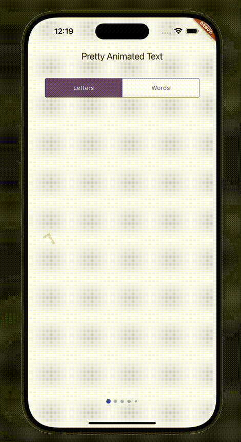
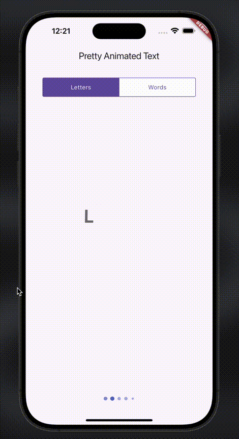
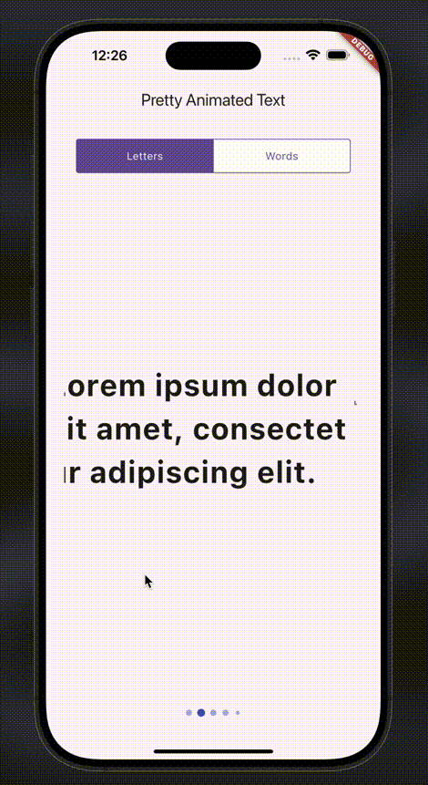
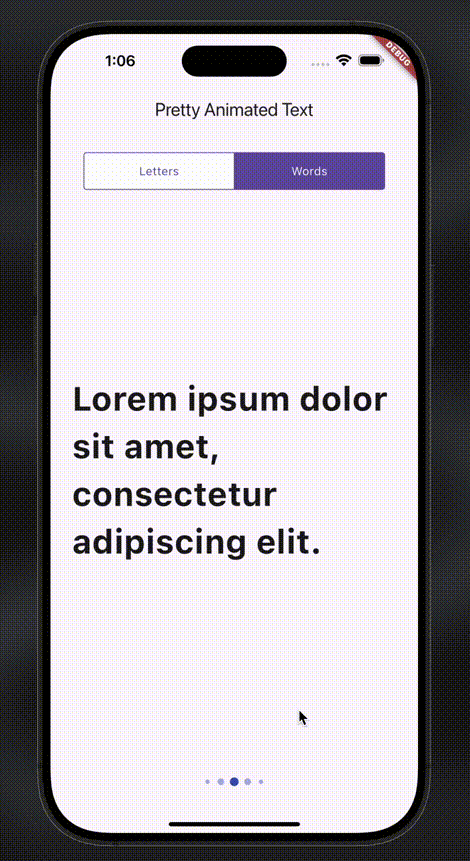
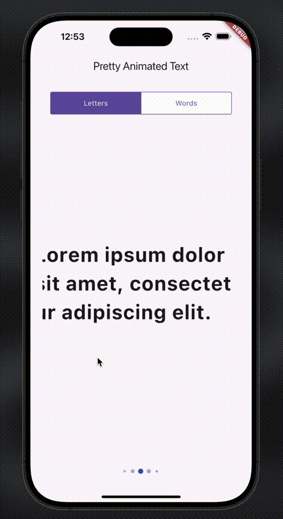
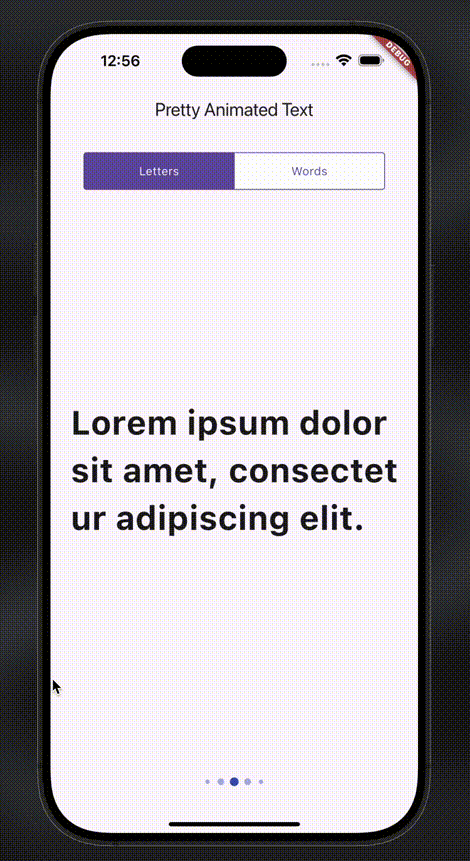
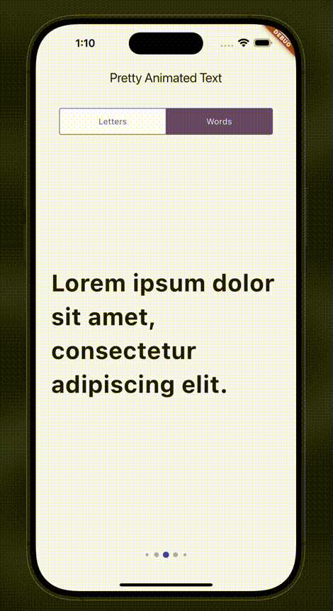
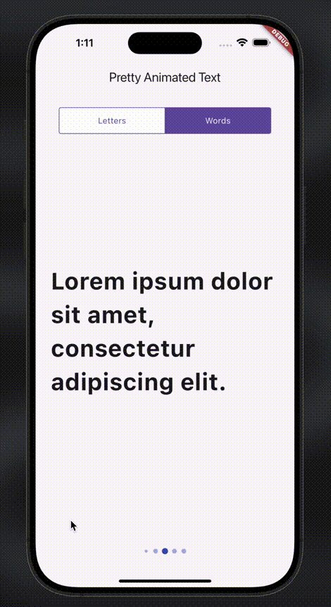

# Pretty Animated Text

[](https://buymeacoffee.com/yloo2)

## Overview

A text animation UI plugin that provides you with gorgeous and customizable animated text widgets so that you can use them effortlessly in your project.

Physics-based animations are utilized for text animations, providing a smooth and delightful experience.

> This project heavily inspires on [jasudev's AnimateText for SwiftUI package](https://github.com/jasudev/AnimateText)


##  Preview Website

Link: https://pretty-animated-text.vercel.app

### Key Features: 

- Various text animation types:
  - Spring animation
  - Chime bell animation
  - Scale animation
  - Rotate animation
  - Blur animation
  - Offset (slide) animation
  - Scramble animation *(new in v2)*
  - Reveal animation with sliding cursor *(new in v2)*
  - Gravity animation — real 2D rigid-body physics (collisions, piling, tap & drag) via forge2d *(new in v2)*
- Supports both letter-by-letter and word-by-word animations
- Customizable animation duration and styles
- Easy to integrate into existing Flutter projects

## Installation
To use this package, add `pretty_animated_text` as a dependency in your `pubspec.yaml` file:

`flutter pub add pretty_animated_text`

### How to

Animations are configured using `AnimationConfig`. There are two main animation types that you can trigger inside the config:
- for word by word → `AnimationType.word`
- for letter by letter → `AnimationType.letter`

You can also pass callbacks to react to animation lifecycle events:
- `onPlay`: Triggered when the animation starts.
- `onComplete`: Triggered when the animation finishes.
- `onPause`, `onResume`, `onDismissed`, etc.

And for texts such as `RotateText` and `OffsetText`, you can trigger some more variations like rotation direction and slide offset.

Currently, the plugin supports default Flutter text alignments:
  - `TextAlign.start`
  - `TextAlign.center`
  - `TextAlign.end`


#### See the demos and examples below:

| Type                               | Word Animation                                                                | Letter Animation                                                                |
| ---------------------------------- | ----------------------------------------------------------------------------- | ------------------------------------------------------------------------------- |
| Spring Text                        |                      |                      |
| Chime Bell Text                    |               | ️              |
| Scale Text                         |                         |                         |
| Blur Text                          |                           |                           |
| Rotate Text (clockwise)            |         |         |
| Rotate Text (anti-clockwise)       |  |  |
| Offest Text (top-bottom)           |        |        |
| Offest Text (bottom-top)           |        |        |
| Offest Text (alternate top-bottom) |    |    |
| Offest Text (left-right)           |        |        |
| Offest Text (right-left)           |        |        |
| Offest Text (alternate left-right) |    | ️   |
| Scramble Text *(v2)*               | coming soon                                                                   | coming soon                                                                     |
| Reveal Text *(v2)*                 | coming soon                                                                   | coming soon                                                                     |
| Gravity Text *(v2)*                | coming soon                                                                   | coming soon                                                                     |

##### Code Examples

- Spring Text
  ```dart
    SpringText(
      text: 'Lorem ipsum dolor sit amet ...',
      style: const TextStyle(fontSize: 18),
      config: AnimationConfig(
        duration: const Duration(seconds: 4), 
        type: AnimationType.word,
        onPlay: (controller) => print('Animation started'),
        onComplete: (controller) => print('Animation completed'),
      ),
    )
  ```
- Chime Bell Text
  ```dart
    ChimeBellText(
      text: 'Lorem ipsum dolor sit amet ...',
      style: const TextStyle(fontSize: 18),
      config: const AnimationConfig(
        duration: Duration(seconds: 4), 
        type: AnimationType.word,
      ),
    )
  ```
- Scale Text
  ```dart
    ScaleText(
      text: 'Lorem ipsum dolor sit amet ...',
      style: const TextStyle(fontSize: 18),
      config: const AnimationConfig(
        duration: Duration(seconds: 4), 
        type: AnimationType.word,
      ),
    )
  ```
- Blur Text
  
  ```dart
    BlurText(
      text: 'Lorem ipsum dolor sit amet ...',
      style: const TextStyle(fontSize: 18),
      config: const AnimationConfig(
        duration: Duration(seconds: 4), 
        type: AnimationType.word,
      ),
    )
  ```
- Rotate Text
  
  For `RotateText`, you can tweak two rotation directions.
  - clockwise → `RotateAnimationType.clockwise` (default)
  - anti-clockwise → `RotateAnimationType.anticlockwise`

  ```dart
    RotateText(
      text: 'Lorem ipsum dolor sit amet ...',
      direction: RotateAnimationType.clockwise,
      style: const TextStyle(fontSize: 18),
      config: const AnimationConfig(
        duration: Duration(seconds: 4), 
        type: AnimationType.word,
      ),
    )
  ```
- Scramble Text *(new in v2)*
  ```dart
    ScrambleText(
      text: 'Lorem ipsum dolor sit amet ...',
      style: const TextStyle(fontSize: 18),
      config: AnimationConfig(
        duration: const Duration(milliseconds: 300),
        type: AnimationType.letter, // or AnimationType.word
      ),
    )
  ```
  Phase 1 (first half of the animation): every character cycles through random
  glyphs. Phase 2 (second half): characters resolve left-to-right into the
  final text. Spaces are never scrambled.

- Reveal Text *(new in v2)*
  ```dart
    RevealText(
      text: 'Lorem ipsum dolor sit amet ...',
      style: const TextStyle(fontSize: 18),
      config: AnimationConfig(
        duration: const Duration(milliseconds: 300),
        type: AnimationType.word, // or AnimationType.letter
      ),
      // Optional: customize the sliding cursor
      cursorColor: Colors.indigo,
      dimOpacity: 0.3, // initial opacity of unrevealed text (default 0.3)
    )
  ```
  All text starts at `dimOpacity` (default 0.3). A cursor sweeps left-to-right
  and each character/word transitions to full opacity as the cursor passes it.

- Gravity Text *(new in v2)*

  A real 2D rigid-body simulation powered by [`forge2d`](https://pub.dev/packages/forge2d)
  (a Box2D port). The whole text is visible at rest first; on play each segment
  (letter or word) becomes a physics body and falls under gravity — letters collide,
  pile up on the floor between the walls, carry real linear + angular momentum, push
  their neighbours, and rest (sleep) until disturbed. Tap a letter to kick it, or
  press-drag-and-release to throw it.

  ```dart
    GravityText(
      text: 'Lorem ipsum dolor sit amet ...',
      style: const TextStyle(fontSize: 18),
      config: const AnimationConfig(
        type: AnimationType.letter, // or AnimationType.word
      ),
      // Optional: tune the physics
      gravity: 30.0, // m/s²
      pixelsPerMeter: 50.0,
      density: 1.0,
      friction: 0.4,
      restitution: 0.1, // bounciness (keep low so piles settle)
      // Optional: stage / interaction
      height: 400, // floor sits at the bottom of the stage (null = fill parent)
      enableInteraction: true, // tap to kick, drag to throw
      kickStrength: 9.0, // m/s imparted to a tapped letter
    )
  ```
  Playback via the controller: `play` / `restart` / `repeat` re-drop the text from its
  reading layout; `pause` / `resume` freeze and run the simulation.

- Offset Text
  
  `OffsetText` has multiple slide effects that you can tweak according to your needs.
  - Top to bottom → `SlideAnimationType.topBottom` (default)
  - Bottom to top → `SlideAnimationType.bottomTop`
  - Alternate top-bottom → `SlideAnimationType.alternateTB`
  - Left to right → `SlideAnimationType.leftRight`
  - Right to left → `SlideAnimationType.rightLeft`
  - Alternate left-right → `SlideAnimationType.alternateLR` 

  ```dart
    OffsetText(
      text: 'Lorem ipsum dolor sit amet ...',
      slideType: SlideAnimationType.topBottom,
      style: const TextStyle(fontSize: 18),
      config: const AnimationConfig(
        duration: Duration(seconds: 4), 
        type: AnimationType.word,
      ),
    )
  ```

###  Project License:
This project is licensed under [MIT License](LICENSE).

Feel free to check it out and give it a  ️ if you love it. 
Follow me for more updates and more projects

> Suggestions are warmly welcome & more updates are coming along the way ...️ 


Copyright (©️) 2024 __YE LWIN OO__


