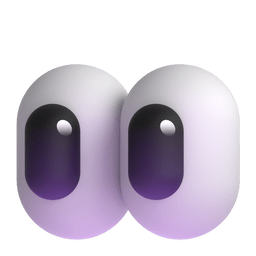

# Pretty Animated Text

##  Overview

A text animation UI plugin that provides you with gorgeous and customizable animated text widgets so that you can use them effortlessly in your project.

Physics-based animations are utilized for text animations, providing a smooth and delightful experience.

> This project heavily inspires on [jasudev's AnimateText for SwiftUI package](https://github.com/jasudev/AnimateText)


##   Preview Website

Link: https://pretty-animated-text.vercel.app

### ️ Key Features: 

- Various text animation types:
  - Spring animation
  - Chime bell animation
  - Scale animation
  - Rotate animation
  - Blur animation
  - Offset (slide) animation
- Supports both letter-by-letter and word-by-word animations
- Customizable animation duration and styles
- Easy to integrate into existing Flutter projects

## ️ Installation
To use this package, add `pretty_animated_text` as a dependency in your `pubspec.yaml` file:

`flutter pub add pretty_animated_text`

### ️ How to

There are two main animation types that you can trigger.
- for word by word → `AnimationType.word`
- for letter by letter → `AnimationType.letter`


And for texts such as `RotateText` and `OffsetText`, you can trigger some more variations like rotation direction and slide offset.

Currently, the plugin supports 6 alignment styles.
  - `TextAlignment.start`
  - `TextAlignment.center`
  - `TextAlignment.end`
  - `TextAlignment.spaceAround`
  - `TextAlignment.spaceBetween`
  - `TextAlignment.spaceEvenly`


#### See the demos and examples below:

| Type                               | Word Animation                                                    | Letter Animation                                                  |
| ---------------------------------- | :-----------------------------------------------------------------: | :-----------------------------------------------------------------: |
| Spring Text                        |      |      |
| Chime Bell Text                     |  | ️ |
| Scale Text                         |      |    |
| Blur Text                          |     |     |
| Rotate Text (clockwise)            |     |     |
| Rotate Text (anti-clockwise)       |      |     |
| Offest Text (top-bottom)           |      |     |
| Offest Text (bottom-top)           |      |     |
| Offest Text (alternate top-bottom) |      |     |
| Offest Text (left-right)           |      |    |
| Offest Text (right-left)           |     |     |
| Offest Text (alternate left-right) |      | ️     |

##### Code Examples

- Spring Text
  ```dart
    SpringText(
          text: 'Lorem ipsum dolor sit amet ...',
          duration: const Duration(seconds: 4), 
          type: AnimationType.word,
          textStyle: const TextStyle(fontSize: 18),
        )
  ```
- Chime Bell Text
  ```dart
    ChimeBellText(
        text: 'Lorem ipsum dolor sit amet ...',
        duration: const Duration(seconds: 4), 
        type: AnimationType.word,
        textStyle: const TextStyle(fontSize: 18),
      ),
  ```
- Scale Text
  ```dart
    ScaleText(
        text: 'Lorem ipsum dolor sit amet ...',
        duration: const Duration(seconds: 4), 
        type: AnimationType.word,
        textStyle: const TextStyle(fontSize: 18),
      ),
  ```
- Blur Text
  
  ```dart
    BlurText(
        text: 'Lorem ipsum dolor sit amet ...',
        duration: const Duration(seconds: 4), 
        type: AnimationType.word,
        textStyle: const TextStyle(fontSize: 18),
      ),
  ```
- Rotate Text
  
  For `RotateText`, you can tweak two rotation directions.
  - clockwise → `RotateAnimationType.clockwise` (default)
  - anti-clockwise → `RotateAnimationType.anticlockwise`

  ```dart
    RotateText(
        text: 'Lorem ipsum dolor sit amet ...',
        direction: RotateAnimationType.clockwise,
        duration: const Duration(seconds: 4), 
        type: AnimationType.word,
        textStyle: const TextStyle(fontSize: 18),
      ),
  ```
- Offset Text
  
  `OffsetText` has multiple slide effects that you can tweak according to your needs.
  - Top to bottom → `SlideAnimationType.topBottom` (default)
  - Bottom to top → `SlideAnimationType.bottomTop`
  - Alternate top-bottom → `SlideAnimationType.alternateTB`
  - Left to right → `SlideAnimationType.leftRight`
  - Right to left → `SlideAnimationType.rightLeft`
  - Alternate left-right → `SlideAnimationType.alternateLR` 

  ```dart
    OffsetText(
        text: 'Lorem ipsum dolor sit amet ...',
        duration: const Duration(seconds: 4), 
        type: AnimationType.word,
        slideType: SlideAnimationType.topBottom,
        textStyle: const TextStyle(fontSize: 18),
      ),
  ```

### ️  Project License:
This project is licensed under [MIT License](LICENSE).

Feel free to check it out and give it a  ️ if you love it. 
Follow me for more updates and more projects

> Suggestions are warmly welcome & more updates are coming along the way ...  ️ 


Copyright (©️) 2024 __YE LWIN OO__


